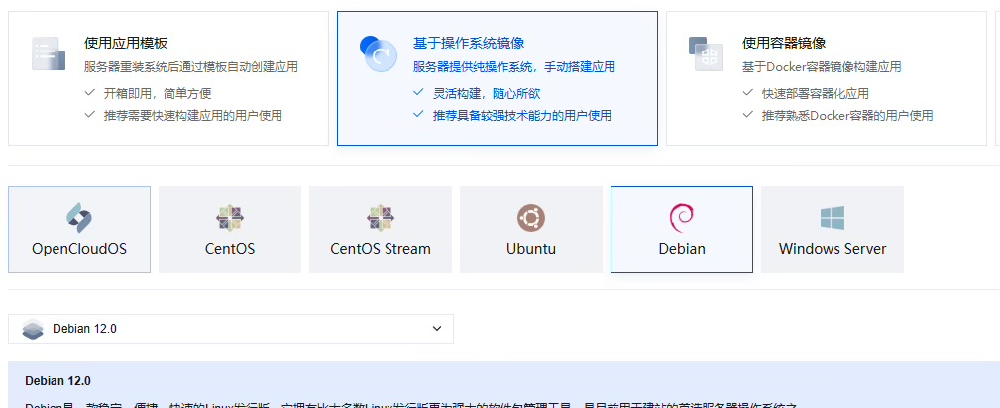
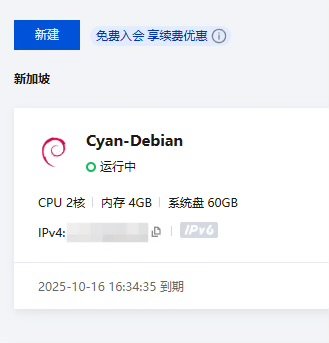

# VPS 云端部署酒馆与Clewd

!!! note "作者：染月青花"

	那么首先, 你要有一台云服务器, 请自行解决这个问题, 无论是选择几大服务器供应商, 还是什么奇怪的东西, 这点上请自行其便。唯一一点忠告就是, 尽量选择位置合适的境外服务器, 服务器自身既不在墙内(服务器可以畅通无阻的连上各家LLM), 并且服务器自身没有被墙(你自己的设备能畅通无阻的连上服务器)

## 1 服务器自身的配置

当你选择一台服务器之后,服务器供应商通常会给你提供一些可选的linux系统, windows server这个东西的部署不会包含在这里, 仅面向linux

### 1.1 系统的选择

系统的选择都没什么太大差别, debian/ubuntu或是其他什么你喜欢的,你只要知道你的系统如何使用包管理器和配置sshd就可以了(或者你知道什么, 熟悉什么, 就选什么),这一点上可以自行其便, 教程中将以 Debian12为例

{ loading=lazy }

然后, 在创建服务器实例的时候,记住你的服务器ip地址与填入的登录密钥

!!! danger "警告"

	重点! 如果你不打算配置密钥对登录,那么一定要填入一个强密码, 超强密码,因为弱密码几乎肯定会被扫描脚本暴力破解,然后你的服务器就成了人家随意进出控制的玩具了,不要抱有侥幸心理, 在你的服务器被拿去当肉鸡之后,服务器商不仅会封掉你的服务器, 甚至不给你退钱,这也是最轻的损失, 重则你的API会被泄露被人刷爆

{ loading=lazy }
{ loading=lazy }

!!! warning "切记"

	记住你的密码

### 1.2 连接你的服务器

!!! info "ps"

	接下来的教程使用的 linux 发行版为: Debian12

Windows10/11几乎都自带有OpenSSH这一工具, 可以直接用于诸多与服务器相关的操作
首先, 打开你的 Windows 终端 或者 Windows PowerShell

