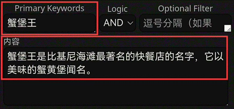
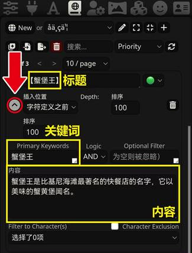
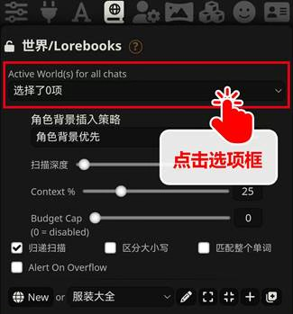
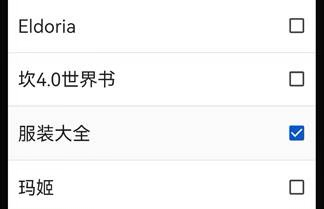
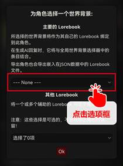
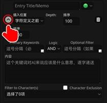

# 世界书

!!! note "作者：@破坏轨道"

## 1. 功能简介

!!!info "世界书 (Lorebooks)旨在为你的角色卡提供更为完整的背景信息。"

	它的功能类似于【词典】或【百科】：

	比如你正在玩一张**海绵宝宝**的角色卡，你发送一段话：“**海绵宝宝出发去蟹堡王工作。**”这时claude可能无法理解“蟹堡王”是什么。

	而如果你有以下世界书：
	{ loading=lazy }

	这时，你发送的话中的“蟹堡王”三个字会触发世界书，claude就能够理解蟹堡王是一家快餐店。

**世界书的最基本使用方式是【触发】，即以关键词 (Keywords) 触发内容 (Content)**

## 2. 基础操作

你可以下载别人的世界书[（类脑Discord频道）](https://discord.com/invite/B7Wr25Z7BZ)，
也可以[创建自己的世界书](https://sqivg8d05rm.feishu.cn/docx/P2QrdeUbToJMBYxeLCQcEBfLnGg#doxcnKxSujFw78ImTUfthntXOZC)。仅通过本节内容，
你就能学会世界书最基本的操作方法。

!!! warning "注意"

	如果你已经会导入、绑定、创建等基础操作，请跳转至进阶使用继续阅读。

### 2.1 导入导出

!!! info "条目"

	本条目是指手动导入世界书，导入角色卡自带世界书的情况参见下文的自带绑定的角色世界书。

1. 在导入之前，先确认你下载的世界书的格式。世界书和破限一样，后缀是**.json**。

2. 打开酒馆，点击页面并导入json文件。

{ loading=lazy }

3. 导入成功后，下滑页面，就可以看到作者所创建的世界书了。

{ loading=lazy }.

点击**左侧的小箭头**，可以打开查看每一条目的详细信息。一般来说，新手下载世界书后无需进行修改。

### 2.2 重命名和删除

如果你下载的世界书是中文命名的，
那么导入酒馆后会转换成一串字符。

数字和英文则不会发生变化。因此有时我们需要重命名世界书。如果不需要该世界书，则可以删除。

{ loading=lazy }

### 2.3 设置世界书

!!! warning "提示"

	我们手动下载的世界书分为两类，【全局世界书】和【角色世界书】。

	> 全局世界书：对你的所有角色卡都起效，例如武器大全、服装大全等。

	> 角色世界书：只对它绑定的角色卡起效，例如海绵宝宝的故事背景。

#### 2.3.1 设置全局世界书

- 点击后弹出世界书选项框

{ loading=lazy }

- 勾选你想使用的全局世界书

{ loading=lazy }

- 勾选后，安卓版会显示项数，电脑版会显示世界书名称

{ loading=lazy }

#### 2.3.2 设置角色世界书

角色世界书需要绑定角色卡，步骤不同于全局世界书。我们首先切换到**角色卡界面**：

{ loading=lazy }
{ loading=lazy }
{ loading=lazy }

点击OK，我们会看到角色卡界面的小地球变绿了，

这说明世界书和角色卡绑定成功了🎉。再次点击绿色小地球，酒馆会跳转到世界书页面。

#### 2.3.3 自带绑定的角色世界书

有一些角色卡是自带绑定的，我们导入卡后，点击角色卡，就会收到一条提示，点击**Yes**即可。然后该卡会**自动创建相应的世界书**并自动绑定。

#### 2.3.4 世界书跟随角色卡导出

如果你希望把带世界书的角色卡分享给其他人玩，那么先确保你的角色卡界面的小地球是绿色状态，然后直接导出角色卡即可。

#### 2.3.5 解除绑定世界书

解除全局世界书的作用，只需在相应选项框中取消勾选即可。然而有的朋友可能会发现，

角色世界书无法通过再次点击小地球解除绑定：点击后会跳转至世界书页面。

要解除角色世界书的绑定，我们需要点击小地球下方的“更多…”选项框。

{ loading=lazy }

{ loading=lazy }

### 2.4 创建世界书

更多时候，我们无法找到满意的世界书，这时就需要自己创建世界书或创建条目了。

1. 来到世界书页面，点击“🌏New”图标，创建新世界书，并为你的世界书命名。
{ loading=lazy } 

2. 创建成功后，点击工具栏中的➕，创建新条目。其他图标的作用会稍后介绍。
{ loading=lazy } 

3. 点击左侧小箭头打开条目明细。

{ loading=lazy } 

4. 填写关键词和内容。注意，如果你希望多个关键词都指向一个内容，那么你需要用英文半角“,”将这些关键词隔开。（不明白什么是半角的去百度）

{ loading=lazy } 

5.  其他图标。这些图标不是特别常用

- 同时展开所有条目的细则。
- 同时折叠所有条目的细则。
- 一键将关键词填入标题。如果有多个关键词则填入第一个。如上述示例中，“宝可梦”一词会被填入“Entry Title/Memo”栏。
- 重命名。上文已介绍。

!!! note “至此，世界书的基础操作已经介绍完毕了！！！“

    然而——虽然世界书有助于剧情的补充和引导，但不一定保证你所设定的内容一定生成在角色的回复中。为了加强世界书的作用，以下是一些进阶的玩法。

## 3. 进阶使用

### 3.1 上下文的概念

在进阶教程之前，上下文 (Context) 是你必须知道的重要概念。你可以把上下文理解为“记忆”。

我们通常说 Claude 的记忆是100k 25k，就是指 Claude 的上下文容量为25k tokens。过多的 tokens 会被清出上下文，也就是我们常说的“记不住了”。

!!! abstract "提示"

	本章尽量解释清楚上下文的概念。如果你很清楚上下文的概念，请跳转至：[条目参数](https://sqivg8d05rm.feishu.cn/wiki/ZJ9Yw0X7JipJrlkAoT0cku54nMb#WxoudlSrRoq8DNxYSZrct6MSnig)。如读完此篇仍对上下文有疑问，可结合此条目浏览：[重要概念：上下文](https://sqivg8d05rm.feishu.cn/wiki/UmWhwf6zviRZ7SkC1rhcIgFXnnd#Gs4KdDxuDogcVWxTrtvc5iBunn5)。

